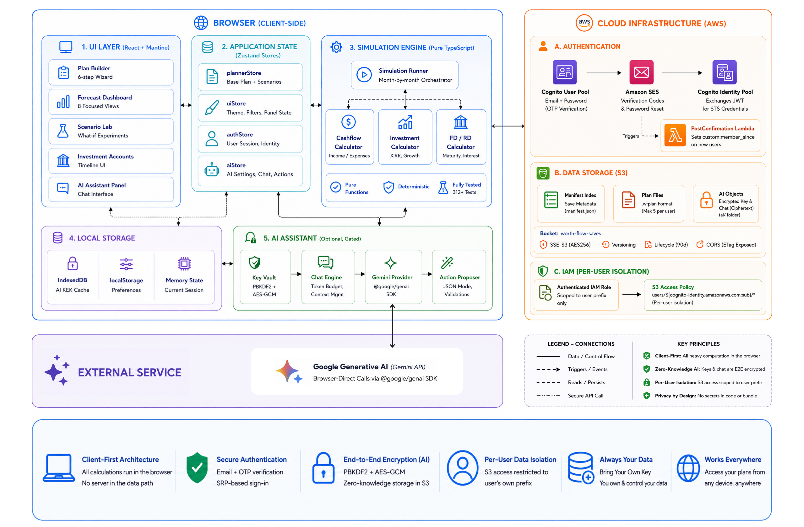

# 💰 Worth Flow

A personal finance forecasting tool that helps you understand how your money, investments, and net worth may evolve over time.

Build a plan, test "what if" scenarios on top of it, and compare outcomes. Sign in with your own account and your plans sync securely to the cloud — available from any device, while still computing entirely in your browser.

## ✨ What You Can Do

### 🧭 Build Your Plan

A guided **Plan Builder** wizard walks you through setting up your starting point:

1. **Forecast Timeline** — choose a start month and horizon (12–48 months)
2. **Financial Baseline** — monthly income, monthly expenses, opening cash balance
3. **Investment Accounts** — add one or more existing portfolios
4. **Events** — one-off expenses, recurring expenses, credit card bills, bonuses, salary changes
5. **Instruments** — existing Fixed Deposits and Recurring Deposits
6. **Review & Generate** — inspect a summary, export the config, and generate your forecast

Every item you add can be **edited** in place (pencil icon) or removed. Accounts and events are kept inside the forecast window; if you move the timeline and something ends up outside it, Review offers a one-click **Move all into the window** fix. You can re-run the builder at any time to start a new plan from scratch.

A first-time **guided tour** highlights the Forecast page after you generate your first plan, and a **Scenario Lab tour** walks through every tab of the Lab. Replay either from the **Tutorials** menu (the **?** button in the header).

### 📈 Forecast Your Finances

Generate month-by-month projections for:

* Cash Balance
* Investments
* Fixed Deposits (FD)
* Recurring Deposits (RD)
* Net Worth
* XIRR (Money-Weighted Return)

### 🎭 Test Different Scenarios

Explore alternate futures without modifying your base plan, using the **Scenario Lab** — a panel you open from the menu button (☰) in the header.

Examples:

* Salary changes
* Bonuses
* Major expenses (one-off, recurring, credit card)
* **Spending Override** — replace your baseline monthly spend for any date range
* **Opening Cash Override** — start the scenario with a different cash balance (negative values allowed)
* New investment accounts
* Investment deposits & withdrawals
* Contribution and return overrides
* FD and RD creation

A **Scenario Banner** keeps you oriented: it summarizes how many modifications are active, offers **Undo/Redo** across all scenario changes (with history that travels with your saved plan, so it's consistent on any device), shows a badge per event type (click to jump straight to that group in the Events list), and flags any accounts created (**"New account"**) or hidden (**"Removed base acc"**) during the scenario.

The **Scenario Lab** is organized into six sections — **Expenses**, **Cash**, **Investments**, **FD**, **RD**, and **Events** — so each type of modification has a focused home.

Instantly compare results against your original plan. Save named scenarios within your plan and switch between them; saving, exporting, or importing always captures the **whole plan** (base plan + active changes + every saved scenario) as one snapshot.

### 📊 Track Investments

Manage multiple investment accounts independently.

For each account you can:

* Define opening balance, start month, monthly contribution, and expected return
* Add deposits
* Make withdrawals
* Create contribution (amount) overrides for a date range
* Create return overrides for a date range
* Delete the account entirely — with confirmation, cascading to its overrides, deposits, and withdrawals

Each account's detail view shows a **visual schedule timeline** — every segment of its contribution and return history is explicitly labeled (Default Contribution, Amount Override, Default Return, Return Override) so you always know what's driving the numbers, and overrides can be edited or removed right from there.

Track performance using:

* Current Value
* Total Contributions
* XIRR
* Net Worth Impact

Accounts added during a scenario (not part of your original plan) are marked with an **"Added"** badge.

### 🏦 Plan Fixed Deposits & Recurring Deposits

Model both existing and future deposits.

#### Fixed Deposits

* Create new FDs (principal, rate, start month, duration)
* Track maturity values
* Automatic payout handling at maturity

#### Recurring Deposits

* Monthly contributions, rate, start month, duration
* Interest accrual
* Automatic maturity payouts

New FD/RD/Deposit amounts are validated against your projected **available cash** at the chosen month — you can't commit more than the plan can actually afford.

### 💸 Understand Cash Flow

See where money comes from and where it goes.

#### Income

* Salary
* Bonuses
* Investment Withdrawals
* FD Maturities
* RD Maturities

#### Expenses

* Living Expenses (baseline, with optional per-range Spending Override)
* Credit Card Payments
* One-Off Expenses
* Recurring Expenses (Monthly or Annual)
* Investments
* FD Creation
* RD Contributions

### 🔎 Filter by Month Range

A single, global **month-range filter** sits above the dashboard. Set a "From"/"To" window and every time-series table and timeline narrows to that range together

*(Available-cash checks for new FDs/RDs/deposits always use the full forecast, regardless of this filter.)*

### 📈 Visualize Your Future

Interactive dashboards help you understand:

* Cash Position
* Investment Growth
* Net Worth Progression
* Financial Events
* Scenario Impact

### 🤖 Ask the AI Assistant (Requires SETUP)

An optional, **bring-your-own-key** assistant — powered by Google Gemini (free and paid models) — you can chat with about your forecast:

* Ask things like *"When does my cash dip lowest, and why?"* or *"Summarise my FD maturities for the next two years."* Replies stream in real time, formatted with bold figures, lists, and tables.
* **Grounded in the engine** — every number it quotes comes straight from Worth Flow's simulation, never from the model's own arithmetic, so answers always match your forecast.
* **Suggests changes you confirm** — tap the wand (or just send a clear instruction like *"create an FD…"* or *"I want to add…"*; questions stay normal chat) to have it propose a scenario change: add, edit, or remove almost anything the Scenario Lab can (expenses, salary/bonus, overrides, FDs/RDs, deposits/withdrawals, even a new investment account). You see a plain-language summary and an estimated impact, and impossible changes are flagged before you apply. The AI never changes your plan on its own — you **Apply** or **Dismiss**, one change at a time, within the same guardrails as the manual forms.
* **Zero-knowledge by design** — your API key and chat are encrypted in your browser with a passphrase only you know, then synced (as ciphertext) across your devices. Worth Flow can never read either.
* Fully optional and removable; calls go directly from your browser to Google with your own key — no Worth Flow server in the loop. See [MANUAL.md → AI Assistant](./MANUAL.md#14-ai-assistant).

## 🧱 Core Concepts

### Base Plan

Your primary financial plan, created via the Plan Builder.

Contains:

* Income
* Expenses
* Cash
* Investments
* FDs
* RDs
* Forecast Horizon

### Scenarios

Temporary modifications applied on top of the Base Plan.

Examples:

* New investment account
* Salary increase
* Unexpected expense
* Investment deposit
* Return override

Scenarios live **inside** your plan, not as separate files. **Save scenario** snapshots your *currently active* set of changes under a name; **Reset** clears all active changes and restores the plan to its last loaded/saved baseline (removing investment accounts you created in the session, or restoring ones you deleted). When you save or export, the **whole plan state** is captured as one snapshot — the base plan, the changes currently active, *and* every named scenario — so loading it back restores all of them in exactly the same condition.

### Investment Accounts

Each investment account is managed independently.

Examples:

* Index Fund
* Mutual Funds
* NPS
* US Stocks
* Retirement Portfolio

Accounts support:

* Monthly contributions
* Deposits
* Withdrawals
* Contribution overrides
* Return overrides
* Deletion (cascades to its overrides, deposits, and withdrawals)

## 📋 Available Views

The dashboard offers eight focused views, all driven by a single global month-range filter:

| View | Shows |
| --- | --- |
| **Forecast** | Month-by-month projections of cash, investments, and net worth |
| **Cashflow** | Detailed income vs. expense breakdown per month |
| **Net Worth** | Asset growth over time |
| **Instruments** | Every FD/RD — rate, duration, maturity month, principal, interest, maturity value |
| **One-Offs** | All one-off expenses with month and amount |
| **Timeline** | Chronological view of all financial events |
| **Investment Timeline** | Timeline focused on investment-related activity (account creation, deposits, withdrawals, overrides) |
| **Investment Accounts** | Per-account value, visual contribution/return schedule, overrides, XIRR, and deletion |

## 💾 Save, Import & Export

### ☁️ Cloud Saves

Sign in with your account and save complete plans to the cloud — up to **5 named saves** per account, accessible from any device.

* **Save current plan** — give it a label; the save also records a snapshot of its final net worth and forecast horizon
* **Auto-load on sign-in** — your most recent save opens automatically; brand-new accounts land on an empty builder
* **Load, download, or delete** any save from your **Profile**
* **Overwrite** an existing save in place
* **Unsaved-changes guard** — loading a save warns you first if your current plan has edits that haven't been saved
* **Offline-aware** — if the cloud can't be reached at sign-in, you'll see a retry banner instead of losing your place

Each account's data is fully isolated — you can only ever access your own saves. See [INFRA.md](./INFRA.md) for the security model.

### Save Scenarios

Store multiple scenario variations and switch between them instantly.

### Export Plans

Export complete plans (base plan, active scenario, saved scenarios, and undo/redo history) as a `.wfplan` file for:

* Backup
* Sharing
* Archival

### Import Plans

Restore previously exported plans with built-in validation. (Cloud saves use the same `.wfplan` format, so a downloaded cloud save can be re-imported anywhere.)

## 🔒 Accounts & Data Privacy

Individual **email + password accounts** via Amazon Cognito: sign up, verify your email with a
one-time code, and sign in (Secure Remote Password — your password never crosses the wire).
Forgot-password resets via an emailed code. The app never stores a password.

Plans are computed **entirely in your browser** — no application server does the math. Saves are
written **directly to private cloud storage scoped to your account** (enforced by IAM, not the
client), so no other user or the app itself can read them. Signing out clears your plan from the
browser. The full model — auth, isolation, and the zero-knowledge AI key vault — is in
**[SECURITY.md](./SECURITY.md)**.

> Worth Flow can also run in a local **mock mode** with no cloud account, for development. See [INFRA.md](./INFRA.md).

## 🌙 Theme Support

* Light Mode
* Dark Mode

Theme preference is saved automatically.

## 🚀 Getting Started

### Local development (no AWS needed)

```bash
npm install
npm run dev:mock
```

This runs in **mock mode** — authentication is emulated in your browser and no cloud account is required. For the full walkthrough (mock sign-in, optional local cloud saves, tests), see **[QUICKSTART.md](./QUICKSTART.md)**.

### Production

Backed by AWS Cognito + S3. See **[INFRA.md](./INFRA.md)** for the full setup, the production env variables, and deployment.

### Common scripts

| Script | Purpose |
| --- | --- |
| `npm run dev:mock` | Local dev server (mock auth, no AWS) |
| `npm run dev` | Dev server in cognito mode (needs live AWS) |
| `npm test` / `npm run test:watch` | Run the engine test suite ([Vitest](https://vitest.dev)) |
| `npm run build` | Type-check + production build |
| `npm run preview` | Preview the production build |
| `npm run lint` | Run ESLint |

## 📚 Documentation

This README is the product overview and feature tour. Each companion guide has one focused job:

| Doc | For | What it covers |
| --- | --- | --- |
| ⚡ **[QUICKSTART.md](./QUICKSTART.md)** | Developers | Run the app locally in mock mode (no AWS) — setup, tests, scripts |
| 👉 **[MANUAL.md](./MANUAL.md)** | End users | Every feature — accounts, plans, scenarios, saves, reports |
| 🏗️ **[INFRA.md](./INFRA.md)** | Operators | Cloud architecture, Terraform provisioning, and deployment |
| 🔒 **[SECURITY.md](./SECURITY.md)** | Operators | Auth & OTP, per-user cloud isolation, the zero-knowledge AI key vault, reporting |

## 🛠️ Built With

**Frontend**

* React
* TypeScript
* Vite
* Mantine (Core, Charts, Hooks, Notifications)
* Zustand
* Zod
* Recharts
* Tabler Icons
* Vitest (engine test suite)

**Cloud (accounts & saves)**

* AWS Cognito (User Pool + Identity Pool) via `aws-amplify`
* Amazon S3 via `@aws-sdk/client-s3`
* Amazon SES, AWS Lambda
* Terraform (infrastructure as code)

**AI assistant (optional)**

* Google Gemini (`@google/genai`) — browser-direct, bring-your-own-key
* The assistant answers from a grounded forecast context block and can propose confirmable plan changes
* WebCrypto (PBKDF2 + AES-GCM) zero-knowledge key vault; IndexedDB KEK cache
* `react-markdown` + `remark-gfm` for formatted replies



> Full infrastructure detail in [INFRA.md](./INFRA.md).

## 🎯 Questions Worth Flow Can Help Answer

* Can I afford a major purchase?
* How much cash will I have available in the future?
* How will a salary change affect my finances?
* What happens if my monthly spending rises or falls for a period?
* What if I start the scenario with more or less cash?
* What happens if investment returns are lower than expected?
* Should I invest more or create an FD?
* How much could my net worth grow?
* What is my portfolio's XIRR?
* What is my lowest future cash position?
* How do different scenarios compare?

**Plan smarter. Forecast confidently. Build wealth intentionally.**
